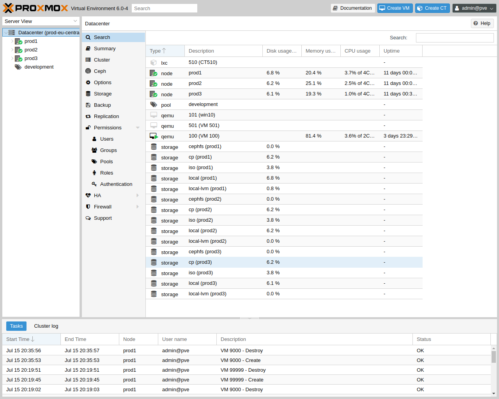
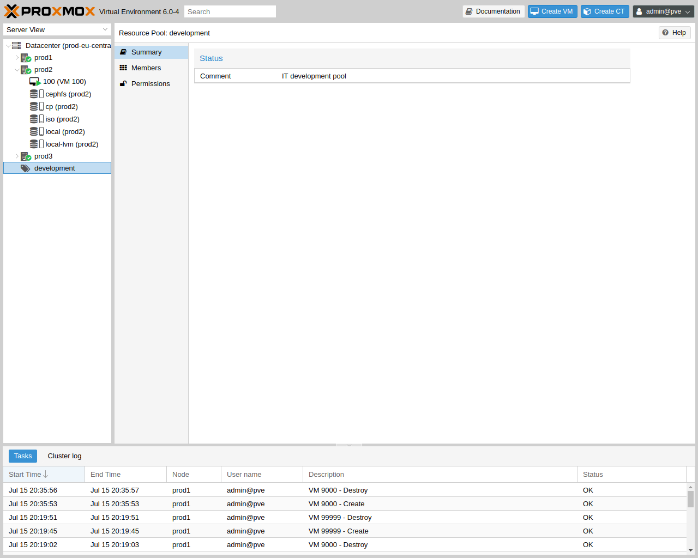

# 4. GUI

Proxmox VE는 간단합니다. 별도의 관리 도구를 설치할 필요가 없으며 웹 브라우저를 통해 모든 작업을 수행할 수 있습니다(최신 Firefox 또는 Google Chrome 권장). 내장된 HTML5 콘솔은 게스트 콘솔에 액세스하는 데 사용됩니다. 대안으로 SPICE를 사용할 수도 있습니다.<br>

Proxmox 클러스터 파일 시스템(pmxcfs)을 사용하기 때문에 어느 노드에나 연결하여 전체 클러스터를 관리할 수 있습니다. 각 노드는 전체 클러스터를 관리할 수 있으며, 전용 관리자 노드가 필요하지 않습니다.<br>

모든 최신 브라우저에서 웹 기반 관리 인터페이스를 사용할 수 있습니다. 모바일 장치에서 연결 중임을 Proxmox VE가 감지하면 더 간단한 터치 기반 사용자 인터페이스로 리디렉션됩니다.<br>

웹 인터페이스는 https://proxmox-ip:8006(기본 로그인 계정은 **root**이며, 비밀번호는 설치 과정에서 설정)를 통해 접속할 수 있습니다.<br><br>

## 4.1. 특징

- Proxmox VE 클러스터의 원활한 통합 및 관리
- 리소스의 동적 업데이트를 위한 AJAX 기술
- SSL 암호화(https)를 통해 모든 가상 머신 및 컨테이너에 대한 보안 액세스 보장
- 수백, 수천 개의 가상 머신을 처리할 수 있는 빠른 검색 기반 인터페이스
- 보안 HTML5 콘솔 또는 SPICE
- 모든 객체(VM, 스토리지, 노드 등)에 대한 역할 기반 권한 관리
- 다중 인증 소스 지원(예: 로컬, MS ADS, LDAP, ...)
- 2단계 인증(OATH, Yubikey)
- ExtJS 7.x JavaScript 프레임워크 기반

<br><br>

## 4.2. 로그인
<br>

서버에 연결하면 먼저 로그인 창이 표시됩니다. Proxmox VE는 다양한 인증 백엔드(<point>Realm</point>)를 지원하며, 여기에서 언어를 선택할 수 있습니다. GUI는 20개 이상의 언어로 번역되어 있습니다.

>  참고<br>
> 하단의 확인란을 선택하면 클라이언트 측에서 사용자 이름을 저장할 수 있습니다.<br>
> 이렇게 하면 다음에 로그인할 때 입력하는 시간을 절약할 수 있습니다.

<br>

## 4.3. GUI 개요
<br>

Proxmox VE 사용자 인터페이스는 네 가지 영역으로 구성됩니다.

- 헤더 : 상단에 있습니다. 상태 정보를 표시하고 가장 중요한 작업을 위한 버튼이 포함되어 있습니다.

- 리소스 트리 : 왼쪽에 있습니다. 특정 개체를 선택할 수 있는 탐색 트리입니다.

- 콘텐츠 패널 : 중앙 영역입니다. 선택한 객체는 여기에 구성 옵션과 상태를 표시합니다.

- 로그 패널 : 하단에 있습니다. 최근 작업에 대한 로그 항목을 표시합니다. : 해당 로그 항목을 두 번 클릭하여 자세한 내용을 보거나 실행 중인 작업을 중단할 수 있습니다.

>  참고<br>
> 리소스 트리 및 로그 패널의 크기를 축소 및 확장하거나 로그 패널을 완전히 숨길 수 있습니다.<br>
> 이 기능은 작은 디스플레이에서 작업하면서 다른 콘텐츠를 볼 수 있는 공간이 더 필요할 때 유용할 수 있습니다.

<br>

### 4.3.1. 헤더

왼쪽 상단에서 가장 먼저 보이는 것은 Proxmox 로고입니다. 그 옆에는 현재 실행 중인 Proxmox VE 버전이 표시됩니다. 옆에 있는 검색 창에서 특정 객체(VM, 컨테이너, 노드 등)를 검색할 수 있습니다. 리소스 트리에서 개체를 선택하는 것보다 더 빠른 경우도 있습니다.<br>

헤더의 오른쪽 부분에는 4개의 버튼이 있습니다:

- <point>Documentation</point> : 참고 문헌이 새 브라우저 화면으로 보여집니다.

- <point>Create VM</point> : 가상 머신 생성 마법사를 엽니다.

- <point>Create CT</point> : 컨테이너 생성 마법사를 엽니다.

- <point>User Menu</point> : 현재 로그인한 사용자의 ID를 표시하며, 이를 클릭하면 사용자별 옵션이 있는 메뉴가 열립니다. : 사용자 메뉴에는 로컬 UI 설정을 제공하는 **My Settings**가 있습니다. 그 아래에는 2단계 인증(**TFA**) 및 **Password** 셀프 서비스에 대한 바로 가기가 있습니다. 언어(**Language**) 및 테마(**Color Theme**)를 변경할 수 있는 옵션도 있습니다. : 마지막으로 메뉴 하단에는 로그아웃(**Logout**) 옵션이 있습니다.

<br>

### 4.3.2. My Settings

<br>

<point>My Setting</point>에서는 로컬에 저장된 설정을 지정할 수 있습니다. 총량에 특정 스토리지를 포함하거나 포함하지 않도록 설정할 수 있는 대시보드 스토리지가 포함됩니다. 스토리지를 선택하지 않으면 총량은 모든 스토리지의 합계이며, 모든 스토리지를 활성화하는 것과 동일합니다.<br>

대시보드 설정 아래에는 저장된 사용자 이름과 이를 지우는 버튼, GUI의 모든 레이아웃을 기본값으로 재설정하는 버튼이 있습니다.<br>

오른쪽에는 <point>xterm.js</point> 설정이 있습니다. 여기에는 다음 옵션이 포함되어 있습니다:

- <point>Font-Family</point> : xterm.js에서 사용할 글꼴(예: Arial).

- <point>Font-Size</point> : 사용할 기본 글꼴 크기입니다.

- <point>Letter Spacing</point> : 텍스트에서 글자 간 간격을 늘리거나 줄입니다.

- <point>Line Height</point> : 줄의 절대 높이를 지정합니다.

<br>

### 4.3.3. 리소스 트리

이것은 주요 탐색 트리입니다. 트리 위에서 미리 정의된 뷰를 선택할 수 있으며, 이는 아래 트리의 구조를 변경합니다. 기본 뷰는 <point>Server View</point>이며, 다음과 같은 개체 유형을 표시합니다:

- <point>Datacenter</point> : 클러스터 전체 설정을 포함합니다(모든 노드에 해당).

- <point>Node</point> : 게스트가 실행되는 클러스터 내부의 호스트를 나타냅니다.

- <point>Guest</point> : VM, 컨테이너 및 템플릿.

- <point>Storage</point> : 데이터 스토리지.

- <point>Pool</point> : 관리를 간소화하기 위해 풀을 사용하여 게스트를 그룹화할 수 있습니다.

<br>

다음 뷰 유형을 사용할 수 있습니다:

- <point>Server View</point> : 노드별로 그룹화된 모든 종류의 객체를 표시합니다.

- <point>Folder View</point> : 객체 유형별로 그룹화된 모든 종류의 객체를 표시합니다.

- <point>Pool View</point> : Pool별로 그룹화된 VM과 컨테이너를 표시합니다.

- <point>Tag View</point> : Tag별로 그룹화된 VM과 컨테이너를 표시합니다.

<br>

### 4.3.4. 로그 패널

로그 패널의 주요 목적은 클러스터에서 현재 진행 중인 작업을 보여주는 것입니다. 새 VM을 만드는 것과 같은 작업은 백그라운드에서 실행되며, 이러한 것을 작업(<point>task</point>)이라고 합니다.<br>

이러한 작업의 모든 출력은 별도의 로그 파일에 저장됩니다. 작업 로그 항목을 두 번 클릭하면 해당 로그를 볼 수 있습니다. 실행 중인 작업을 중단할 수도 있습니다.<br>

모든 클러스터 노드의 가장 최근 작업을 여기에 표시합니다. 다른 사람이 다른 클러스터 노드에서 작업 중인지 실시간으로 확인할 수 있습니다.

>  참고<br>
> 로그 패널에서 오래되고 완료된 작업을 제거하여 목록을 짧게 유지합니다.<br>
> 하지만 <point>Task History</point>의 노드 패널에서 해당 작업을 찾을 수 있습니다.

일부 단기 실행 작업은 모든 클러스터 멤버에게 로그를 전송합니다. <point>Cluster log</point> 패널에서 해당 메시지를 볼 수 있습니다.

<br>

## 4.4. 콘텐츠 패널

리소스 트리에서 항목을 선택하면 해당 개체가 콘텐츠 패널에 구성 및 상태 정보를 표시합니다. 다음 섹션에서는 이 기능에 대한 간략한 개요를 제공합니다. 더 자세한 정보를 얻으려면 참고 문헌의 해당 장을 참조하십시오.<br><br>

### 4.4.1. 데이터센터(Datacenter)

<br>

데이터센터 수준에서 클러스터 전체 설정 및 정보에 액세스할 수 있습니다.

- <point>Search</point> : 노드, VM, 컨테이너, 스토리지 장치 및 풀에 대한 클러스터 전체 검색을 수행합니다.

- <point>Summary</point> : 클러스터의 상태 및 리소스 사용에 대한 간략한 개요를 제공합니다.

- <point>Cluster</point> : 클러스터를 만들거나 조인하는 데 필요한 기능과 정보를 제공합니다.

- <point>Options</point> : 클러스터 전체 기본 설정을 보고 관리합니다.

- <point>Storage</point> : 클러스터 스토리지를 관리하기 위한 인터페이스를 제공합니다.

- <point>Backup</point> : 백업 작업을 생성합니다. 이 기능은 클러스터 전체에서 작동하므로 클러스터의 VM/컨테이너가 어디에 있는지는 중요하지 않습니다.

- <point>Replication</point> : 복제 작업을 보고 관리합니다.

- <point>Permissions</point> : 사용자, 그룹 및 API 토큰 권한과 LDAP, MS-AD 및 2단계 인증을 관리합니다.

- <point>HA</point> : Proxmox VE 고가용성을 관리합니다.

- <point>ACME</point> : 서버 노드에 대한 ACME(Let's Encrypt) 인증서를 설정합니다.

- <point>Firewall</point> : Proxmox 방화벽 클러스터 전체에 대한 템플릿을 구성하고 만듭니다.

- <point>Metric Server</point> : Proxmox VE에 대한 외부 메트릭 서버를 정의합니다.

- <point>Notifications</point> : Proxmox VE에 대한 알림 동작 및 대상을 구성합니다.

- <point>Support</point> : 지원 구독에 대한 정보를 표시합니다.

### 4.4.2. 노드(Nodes)

<br>

클러스터의 노드는 이 레벨에서 개별적으로 관리할 수 있습니다.<br>

상단 헤더에는 재부팅(<point>Reboot</point>), 종료(<point>Shutdown</point>), 셸(<point>Sheell</point>), 대량 작업(<point>Bulk Actions</point>) 및 도움말(<point>Help</point>)과 같은 유용한 버튼이 있습니다. Sheell에는 <point>noVNC</point>, <point>SPICE</point> 및 <point>xterm.js</point> 옵션이 있습니다. Bulk Actions에는 대량 시작(<point>Bulk Start</point>), 대량 종료(<point>Bulk Shutdown</point>) 및 대량 마이그레이션(<point>Bulk Migrate</point>) 옵션이 있습니다.<br>

- <point>Search</point> : 노드에서 VM, 컨테이너, 스토리지 장치 및 풀을 검색합니다.

- <point>Summary</point> : 노드의 리소스 사용에 대한 간략한 개요를 표시합니다.

- <point>Notes</point> : 마크다운 구문으로 사용자 지정 주석을 작성합니다.

- <point>Shell</point> : 노드의 셸 인터페이스에 액세스합니다.

- <point>System</point> : 네트워크, DNS 및 시간 설정을 구성하고 syslog에 액세스합니다.

- <point>Updates</point> : 시스템을 업그레이드하고 사용 가능한 새 패키지를 확인합니다.

- <point>Firewall</point> : 특정 노드의 Proxmox 방화벽을 관리합니다.

- <point>Disks</point> : 연결된 디스크에 대한 개요를 얻고 사용 방법을 관리합니다.

- <point>Ceph</point> : 호스트에 Ceph 서버를 설치한 경우에만 사용됩니다. 이 경우 Ceph 클러스터를 관리하고 여기에서 상태를 확인할 수 있습니다.

- <point>Replication</point> : 복제 작업을 보고 관리합니다.

- <point>Task History</point> : 이전 작업 목록을 확인합니다.

- <point>Subscription</point> : 구독 키를 업로드하고 지원 사례에 사용할 시스템 보고서를 생성합니다.

<br><br>

### 4.4.3. 게스트(Guests)

<br>

게스트에는 두 가지 종류가 있으며 둘 다 템플릿으로 변환할 수 있습니다. 하나는 커널 기반 가상 머신(KVM)이고 다른 하나는 Linux 컨테이너(LXC)입니다. 탐색 기능은 대부분 동일하며 일부 옵션만 다릅니다.<br>

다양한 게스트 관리 인터페이스에 액세스하려면 왼쪽 메뉴에서 VM 또는 컨테이너를 선택합니다.<br>

헤더에는 전원 관리, 마이그레이션, 콘솔 액세스 및 유형, 복제, HA 및 도움말과 같은 항목에 대한 명령이 포함되어 있습니다. 이러한 버튼 중 일부에는 드롭다운 메뉴가 포함되어 있습니다. 예를 들어, 종료(<point>Shutdown</point>)에는 다른 전원 옵션도 포함되어 있고 콘솔(<point>Console</point>)에는 <point>SPICE</point>, <point>noVNC</point> 및 <point>xterm.js</point>와 같은 다양한 콘솔 유형이 포함되어 있습니다.<br>

오른쪽 패널에는 왼쪽 메뉴에서 선택한 항목에 대한 인터페이스가 포함되어 있습니다.<br>

사용 가능한 인터페이스는 다음과 같습니다:

- <point>Summary</point> : VM의 활동에 대한 간략한 개요와 마크다운 구문 주석을 위한 메모(**Notes**) 필드를 제공합니다.

- <point>Console</point> : VM/컨테이너의 대화형 콘솔에 액세스합니다.

- <point>(KVM)Hardware</point> : KVM VM에서 사용할 수 있는 하드웨어를 정의합니다.

- <point>(LXC)Resources</point> : LXC에서 사용할 수 있는 시스템 리소스를 정의합니다.

- <point>(LXC)Network</point> : 컨테이너의 네트워크 설정을 구성합니다.

- <point>(LXC)DNS</point> : 컨테이너의 DNS 설정을 구성합니다.

- <point>Options</point> : 게스트 옵션을 관리합니다.

- <point>Task History</point> : 선택한 게스트와 관련된 모든 이전 작업을 봅니다.

- <point>(KVM) Monitor</point> : KVM 프로세스에 대한 대화형 통신 인터페이스입니다.

- <point>Backup</point> : 시스템 백업을 만들고 복원합니다.

- <point>Replication</point> : 선택한 게스트의 복제 작업을 보고 관리합니다.

- <point>Snapshots</point> : VM 스냅샷을 만들고 복원합니다.

- <point>Firewall</point> : VM 수준에서 방화벽을 구성합니다.

- <point>Permissions</point> : 선택한 게스트의 권한을 관리합니다.

<br><br>

### 4.4.4. 스토리지(Storage)

<br>

게스트 인터페이스와 마찬가지로 스토리지 인터페이스는 특정 스토리지에 대한 왼쪽 메뉴와 이러한 요소를 관리하는 오른쪽 인터페이스로 구성됩니다.<br>

이 보기에는 두 개의 파티션 분할 보기가 있습니다. 왼쪽에는 스토리지 옵션이 있고 오른쪽에는 선택한 옵션의 콘텐츠가 표시됩니다.<br>

- <point>Summary</point> : 유형, 사용 및 저장하는 콘텐츠와 같은 저장소에 대한 중요한 정보를 표시합니다.

- <point>Content</point> : 저장소가 저장하는 각 콘텐츠 유형에 대한 메뉴 항목(예: 백업, ISO 이미지, CT 템플릿).

- <point>Permissions</point> : 저장소에 대한 권한을 관리합니다.

<br><br>

### 4.4.5. 풀(Pools)

<br>

다시 말해서, 풀 뷰는 두 개의 파티션으로 구성됩니다. 왼쪽에 메뉴가 있고 오른쪽에 각 메뉴 항목에 해당하는 인터페이스가 있습니다.<br>

- <point>Summary</point> : 풀에 대한 설명을 보여줍니다.

- <point>Members</point> : 풀 멤버(게스트 및 스토리지)를 표시하고 관리합니다.

- <point>Permissions</point> : 풀에 대한 권한을 관리합니다.

<br><br>

## 4.5. 태그

<br>

조직적 목적으로 게스트에 대한 태그(<point>tags</point>)를 설정할 수 있습니다. 현재 이러한 태그는 사용자에게 정보적 가치만 제공합니다. 태그는 웹 인터페이스의 리소스 트리(<point>Resource Tree</point>)와 게스트가 선택되었을 때 상태 표시줄의 두 곳에 표시됩니다.<br>

게스트의 상태 줄에서 <point>연필</point> 아이콘을 클릭하여 태그를 추가, 편집 및 제거할 수 있습니다. `+` 버튼을 눌러 여러 태그를 추가하고 `-` 버튼을 눌러 제거할 수 있습니다. 변경 사항을 저장하거나 취소하려면 각각 `✓` 및 `x` 버튼을 사용할 수 있습니다.<br>

CLI를 통해 태그를 설정할 수도 있으며, 여기서 여러 태그는 세미콜론(`;`)으로 구분됩니다. 예를 들어:

```

# qm set ID --tags myfirsttag;mysecondtag

```

<br>

### 4.5.1. 스타일 구성

<br>

기본적으로 태그 색상은 결정적 방식으로 텍스트에서 파생됩니다. 색상, 리소스 트리의 모양, 대소문자 구분, 태그 정렬 방법은 커스텀할 수 있습니다. 이는 <point>Datacenter → Options → Tag Style Override</point>에서 웹 인터페이스를 통해 수행할 수 있습니다. 또는 CLI를 통해 수행할 수도 있습니다. 예를 들어:

```

# pvesh set /cluster/options --tag-style color-map=example:000000:FFFFFF

```

위 태그 `예제`의 배경색을 검정색(#000000)으로, 텍스트 색상을 흰색(#FFFFFF)으로 설정합니다.<br><br>

### 4.5.2. 권한

<br>

기본적으로 게스트(**/vms/ID**)에서 <point>VM.Config.Options</point> 권한이 있는 사용자는 원하는 모든 태그를 설정할 수 있습니다(권한 관리 참조). 이 동작을 제한하려면 <point>Datacenter → Options → User Tag Access</point>에서 적절한 권한을 설정할 수 있습니다.

- <point>free</point> : 사용자는 태그 설정에 제한이 없습니다(기본값)

- <point>list</point> : 사용자는 미리 정의된 태그 목록에 따라 태그를 설정할 수 있습니다.

- <point>existing</point> : list와 비슷하지만 사용자는 기존 태그도 사용할 수 있습니다.

- <point>none</point> : 사용자는 태그 사용이 제한됩니다.

CLI를 통해서도 동일한 작업을 수행할 수 있습니다.<br>

<point>/</point>에서 <point>Sys.Modify</point> 권한이 있는 사용자는 여기의 설정과 관계없이 항상 모든 태그를 설정하거나 삭제할 수 있습니다. 또한, <point>/</point>에서 <point>Sys.Modify</point> 권한이 있는 사용자만 추가 및 제거할 수 있는 등록된 태그의 구성 가능한 목록이 있습니다. 등록된 태그 목록은 <point>Datacenter → Options → Registered Tags</point> 또는 CLI를 통해 편집할 수 있습니다.<br>

정확한 옵션에 대한 자세한 내용과 CLI에서 이를 호출하는 방법은 데이터 센터 구성을 참조하세요.<br><br><br>
