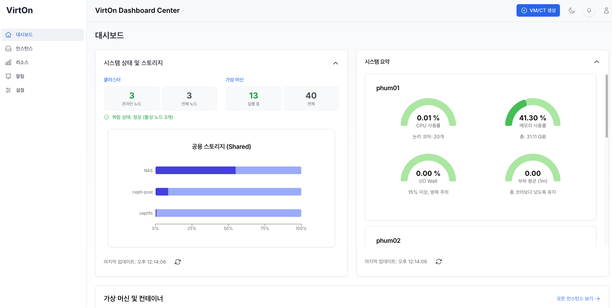

# 4. UI 기능 요소

 
버트온 웹 인터페이스는 모두 5가지 탭으로 구성되어 있습니다.
- <point>대시보드</point> : 호스트 시스템의 실시간 현황 및 상태 확인
- <point>인스턴스</point> : 각 노드의 하드웨어 정보 확인 및 개별 인스턴스 관리에 필요한 리소스 정보 제공
- <point>리소스</point> : 스토리지 사용률, 연결 상태 및 CPU와 메모리 사용률 등 확인
- <point>알림</point> : 클러스터, VM, 스토리지, 백업 등 발생하는 주요 이벤트 출력 및 로그 저장
- <point>설정</point> : Proxmox 사용자 계정을 사용하여 API 연결 설정

  

## 4.1. 대시보드
클러스터 전체 및 각 노드의 CPU, 메모리, 디스크, 네트워크 등 리소스 사용 현황을 통합하여 조회합니다. 또한 노드의 연결 상태, 업타임, 버전 서비스 상태 등을 실시간으로 모니터링하며, 관련 알림 정보를 확인할 수 있습니다. 