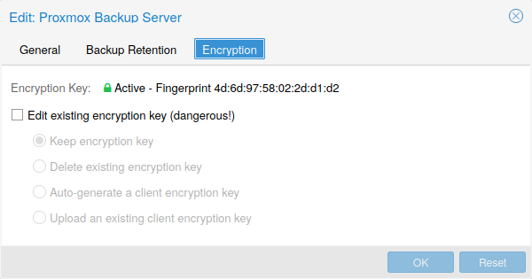

# Proxmox VE 지원 스토리지

Proxmox VE 스토리지 모델은 매우 유연합니다. 가상 머신 이미지는 하나 또는 여러 개의 로컬 스토리지 또는 NFS 또는 iSCSI(NAS, SAN)와 같은 공유 스토리지에 저장할 수 있습니다. 제한이 없으며 원하는 만큼 스토리지 풀을 구성할 수 있습니다. 데비안 리눅스에서 사용 가능한 모든 스토리지 기술을 사용할 수 있습니다.<br>

공유 스토리지에 VM을 저장할 때의 주요 이점 중 하나는 클러스터의 모든 노드가 VM 디스크 이미지에 직접 액세스할 수 있으므로 다운타임 없이 실행 중인 머신을 라이브 마이그레이션할 수 있다는 점입니다. 이 경우 VM 이미지 데이터를 복사할 필요가 없으므로 라이브 마이그레이션이 매우 빠릅니다.<br>

스토리지 라이브러리(패키지 <point>libpve-storage-perl</point>)는 유연한 플러그인 시스템을 사용하여 모든 스토리지 유형에 공통 인터페이스를 제공합니다. 향후 추가 스토리지 유형을 포함하도록 쉽게 채택할 수 있습니다.<br><br>

## 7.1. 스토리지 유형 
기본적으로 스토리지 유형에는 두 가지 클래스가 있습니다:

* <point>파일 수준 스토리지</point>
    * 파일 수준 기반 스토리지 기술을 사용하면 완전한 기능(POSIX) 파일 시스템에 액세스할 수 있습니다. 일반적으로 블록 수준 스토리지(아래 참조)보다 유연하며 모든 유형의 콘텐츠를 저장할 수 있습니다. ZFS는 가장 진보된 시스템으로 스냅샷과 클론을 완벽하게 지원합니다.

* <point>블록 레벨 스토리지</point>
    * 대용량 원본(<point>raw</point>) 이미지를 저장할 수 있습니다. 일반적으로 이러한 스토리지 유형에는 다른 파일(ISO, 백업 등)을 저장할 수 없습니다. 대부분의 최신 블록 레벨 스토리지 구현은 스냅샷과 클론을 지원합니다. RADOS와 GlusterFS는 분산 시스템으로, 스토리지 데이터를 다른 노드에 복제합니다.
<br>

<point> 가능한 스토리지 유형</point>

|스토리지 유형|플러그인 유형|레벨|공유|스냅샷|안정성|
|:---:|:---:|:---:|:---:|:---:|:---:|
|ZFS (local)|zfspool|both :sup:`1` |no|yes|yes|
|Directory|dir|file|no|no :sup:`2` |yes|
|BTRFS|btrfs|file|no|yes|기술 프리뷰|
|NFS|nfs|file|yes|no :sup:`2` |yes|
|CIFS|cifs|file|yes|no :sup:`2` |yes|
|Proxmox Backup|pbs|both|yes|n/a|yes|
|GlusterFS|glusterfs|file|yes|no :sup:`2` |yes|
|CephFS|cephfs|file|yes|yes|yes|
|LVM|lvm|block|no^3|no|yes|
|LVM-thin|lvmthin|block|no|yes|yes|
|iSCSI/kernel|iscsi|block|yes|no|yes|
|iSCSI/libiscsi|iscsidirect|block|yes|no|yes|
|Ceph/RBD|rbd|block|yes|yes|yes|
|ZFS over iSCSI|zfs|block|yes|yes|yes|


<br>

### 7.1.1. 씬 프로비저닝
여러 스토리지와 QEMU 이미지 포맷인 <point>qcow2</point>는 <point>씬 프로비저닝</point>을 지원합니다. 씬 프로비저닝을 활성화하면 게스트 시스템이 실제로 사용하는 블록만 스토리지에 기록됩니다.<br>

예를 들어 32GB 하드 디스크가 있는 VM을 생성하고 게스트 시스템 OS를 설치한 후 VM의 루트 파일 시스템에 3GB의 데이터가 포함되어 있다고 가정해 보겠습니다. 이 경우 게스트 VM에 32GB 하드 드라이브가 표시되더라도 스토리지에는 3GB만 기록됩니다. 이러한 방식으로 씬 프로비저닝을 사용하면 현재 사용 가능한 스토리지 블록보다 더 큰 디스크 이미지를 생성할 수 있습니다. VM을 위한 대용량 디스크 이미지를 생성하고 필요 시 VM의 파일 시스템 크기를 조정하지 않고도 스토리지에 디스크를 더 추가할 수 있습니다.<br>

“스냅샷” 기능이 있는 모든 스토리지 유형은 씬 프로비저닝도 지원합니다.

>  스토리지가 가득 차면 해당 스토리지의 볼륨을 사용하는 모든 게스트에게 IO 오류가 발생합니다. 이로 인해 파일 시스템 불일치가 발생하고 데이터가 손상될 수 있습니다. 따라서 이러한 상황을 방지하기 위해 스토리지 리소스를 과도하게 프로비저닝하지 않거나 여유 공간을 주의 깊게 관찰하는 것이 좋습니다.

<br><br>

## 7.2. 스토리지 구성 
모든 Proxmox VE 관련 스토리지 구성은 <point>/etc/pve/storage.cfg</point>의 단일 텍스트 파일에 저장됩니다. 이 파일은 <point>/etc/pve/</point> 내에 있으므로 모든 클러스터 노드에 자동으로 배포됩니다. 따라서 모든 노드가 동일한 스토리지 구성을 공유하게 됩니다.<br>

스토리지 구성 공유는 모든 노드에서 동일한 “공유” 스토리지에 액세스할 수 있기 때문에 공유 스토리지에 적합합니다. 그러나 로컬 스토리지 유형에도 유용합니다. 이 경우 로컬 스토리지는 모든 노드에서 사용할 수 있지만 물리적으로 다르며 완전히 다른 콘텐츠를 가질 수 있습니다.<br><br>

### 7.2.1. 스토리지 풀 
각 스토리지 풀에는 <point><type></point>이 있으며, <point><STORAGE_ID></point>로 고유하게 식별됩니다. 풀 구성은 다음과 같습니다:
```
<유형>: <STORAGE_ID>
        <프로퍼티> <값
        <프로퍼티> <값
        <property>
        ...
```
<point><type>: <STORAGE_ID></point> 줄은 풀 정의를 시작하고 그 뒤에 속성 목록이 이어집니다. 대부분의 속성에는 값이 필요합니다. 일부 속성에는 합리적인 기본값이 있으며, 이 경우 값을 생략할 수 있습니다.<br>

더 자세히 알아보려면 설치 후 기본 스토리지 구성을 살펴보세요. 여기에는 <point>/var/lib/vz</point> 디렉터리를 가리키며 항상 사용 가능한 <point>local</point>이라는 이름의 특수 로컬 스토리지 풀이 하나 포함되어 있습니다. 설치 시 선택한 스토리지 유형에 따라 Proxmox VE 설치 프로그램이 추가 스토리지 항목을 생성합니다.<br><br>

<point> 기본 스토리지 구성(/etc/pve/storage.cfg)</point><br>

```
dir: local
        path /var/lib/vz
        content iso,vztmpl,backup

# default image store on LVM based installation
lvmthin: local-lvm
        thinpool data
        vgname pve
        content rootdir,images

# default image store on ZFS based installation
zfspool: local-zfs
        pool rpool/data
        sparse
        content images,rootdir
```
>  정확히 동일한 기본 스토리지를 가리키는 여러 스토리지 구성은 문제가 될 수 있습니다. 이러한 <point>별칭(aliase)</point> 스토리지 구성은 정확히 동일한 디스크 이미지를 가리키는 두 개의 서로 다른 볼륨 ID(<point>volid</point>)로 이어질 수 있습니다. Proxmox VE는 이미지의 볼륨 ID가 가리키는 이미지가 고유할 것으로 예상합니다. <point>별칭(aliase)</point> 스토리지 구성에 다른 콘텐츠 유형을 선택하는 것은 괜찮을 수 있지만 권장하지는 않습니다.

<br><br>

### 7.2.2. 일반적인 스토리지 속성 
몇 가지 스토리지 속성은 여러 스토리지 유형에서 공통적입니다.

- <point>nodes</point>
    - 이 스토리지를 사용할 수 있거나 액세스할 수 있는 클러스터 노드 이름 목록입니다. 이 속성을 사용하여 스토리지 액세스를 제한된 노드 집합으로 제한할 수 있습니다.
- <point>content</point>
    - 스토리지가 가상 디스크 이미지, cdrom iso 이미지, 컨테이너 템플릿 또는 컨테이너 root 디렉터리 등 여러 콘텐츠 유형을 지원할 수 있습니다. 모든 스토리지 유형이 모든 콘텐츠 유형을 지원하는 것은 아닙니다. 이 속성을 설정하여 이 스토리지가 사용되는 용도를 선택할 수 있습니다.
    - <point>images</point> : QEMU/KVM VM 이미지
    - <point>rootdir</point> : 컨테이너 데이터 저장
    - <point>vztmpl</point> : 컨테이너 템플릿
    - <point>backup</point> : 백업 파일(<point>vzdump</point>)
    - <point>iso</point> : ISO 이미지
    - <point>snippets</point> : 스니펫 파일(예: 게스트 후크 스크립트)
- <point>shared</point>
    - 모든 노드(또는 <point>nodes</point> 옵션에 나열된 모든 노드)에 동일한 콘텐츠가 있는 단일 저장소임을 나타냅니다. 다른 노드에서 로컬 스토리지의 콘텐츠에 자동으로 액세스할 수 있게 하는 것이 아니라 이미 공유된 스토리지를 그렇게 표시할 뿐입니다.

- <point>disable</point>
    - 이 플래그를 사용하면 스토리지를 완전히 비활성화할 수 있습니다.

- <point>maxfiles</point>
    - 더 이상 사용되지 않습니다. 대신 <point>prune-backups</point>를 사용하세요. VM당 최대 백업 파일 수입니다. 무제한의 경우 <point>0</point>을 사용합니다.

- <point>prune-backups</point>
    - 백업 보존 옵션입니다. 자세한 내용은 백업 보존을 참조하십시오.

- <point>format</point>
    - 기본 이미지 형식(<point>raw|qcow2|vmdk</point>)

- <point>preallocation</point>
    - 파일 기반 스토리지의 <point>raw</point> 및 <point>qcow2</point> 이미지에 대한 사전 할당 모드(<point>off|metadata|falloc|full</point>). 기본값은 <point>metadata</point>이며, <point>raw</point> 이미지의 경우 <point>off</point>로 처리됩니다. 네트워크 저장소를 대용량 <point>qcow2</point> 이미지와 함께 사용할 때는 <point>off</point>를 사용하면 시간 초과를 피하는 데 도움이 됩니다.

>  서로 다른 Proxmox VE 클러스터에서 동일한 스토리지 풀을 사용하는 것은 바람직하지 않습니다. 일부 스토리지 작업에는 스토리지에 대한 독점 액세스가 필요하므로 적절한 잠금이 필요합니다. 이 기능은 클러스터 내에서 구현되지만 다른 클러스터 간에는 작동하지 않습니다.

<br><br>

## 7.3. 볼륨 
당사는 스토리지 데이터에 특별한 표기법을 사용합니다. 스토리지 풀에서 데이터를 할당하면 이러한 볼륨 식별자가 반환됩니다. 볼륨은 <point><STORAGE_ID></point>와 그 뒤에 콜론으로 구분된 스토리지 유형에 따른 볼륨 이름으로 식별됩니다. 유효한 <point><VOLUME_ID></point>는 다음과 같습니다:

- local:230/example-image.raw
- local:iso/debian-501-amd64-netinst.iso
- local:vztmpl/debian-5.0-joomla_1.5.9-1_i386.tar.gz
- iscsi-storage:0.0.2.scsi-14f504e46494c4500494b5042546d2d646744372d31616d61
<point>\<VOLUME_ID></point>의 파일 시스템 경로를 가져오려면 다음을 사용합니다:

```
pvesm path <VOLUME_ID>
```

<br><br>

### 7.3.1. 볼륨 소유권 
<point>image</point> 유형 볼륨에는 소유권 관계가 존재합니다. 이러한 각 볼륨은 VM 또는 컨테이너가 소유합니다. 예를 들어 <point>local:230/example-image.raw</point> 볼륨은 VM 230이 소유합니다. 대부분의 스토리지 백엔드는 이 소유권 정보를 볼륨 이름에 인코딩합니다.<br>

VM 또는 컨테이너를 제거하면 시스템에서 해당 VM 또는 컨테이너가 소유한 모든 관련 볼륨도 제거됩니다.<br><br>

## 7.4. 명령줄 인터페이스 사용
스토리지 풀과 볼륨 식별자의 개념을 숙지하는 것이 좋지만, 실제로는 명령줄에서 이러한 낮은 수준의 작업을 수행할 필요는 없습니다. 일반적으로 볼륨 할당 및 제거는 VM 및 컨테이너 관리 도구에서 수행됩니다.<br>

그럼에도 불구하고 일반적인 스토리지 관리 작업을 수행할 수 있는 <point>pvesm</point>(“Proxmox VE Storage Manager”)이라는 명령줄 도구가 있습니다.<br><br>

### 7.4.1. 예시
- 스토리지 풀 추가
    - <point>pvesm add <TYPE> <STORAGE_ID> <OPTIONS></point>
    - <point>pvesm add dir <STORAGE_ID> --path <PATH></point>
    - <point>pvesm add nfs <STORAGE_ID> --path <PATH> --server <SERVER> --export <EXPORT></point>
    - <point>pvesm add lvm <STORAGE_ID> --vgname <VGNAME></point>
    - <point>pvesm add iscsi <STORAGE_ID> --portal <HOST[:PORT]> --target <TARGET></point>
- 스토리지 풀 비활성화
    - <point>pvesm set <STORAGE_ID> --disable 1</point>
- 스토리지 풀 활성화
    - <point>pvesm set <STORAGE_ID> --disable 0</point>
- 스토리지 옵션 변경/설정
    - <point>pvesm set <STORAGE_ID> <OPTIONS></point>
    - <point>pvesm set <STORAGE_ID> --shared 1</point>
    - <point>pvesm set local --format qcow2</point>
    - <point>pvesm set <STORAGE_ID> --content iso</point>
- 스토리지 풀을 제거(데이터를 삭제하지 않으며, 연결을 끊거나 마운트 해제하지도 않습니다. 스토리지 구성만 제거합니다.)
    - <point>pvesm remove <STORAGE_ID></point>
- 볼륨 할당
    - <point>pvesm alloc <STORAGE_ID> <VMID> <name> <size> [--format <raw|qcow2>]</point>
- 로컬 스토리지에 4G 볼륨을 할당(빈 문자열을 <NAME>으로 전달하면 이름이 자동으로 생성됩니다.)
    - <point>pvesm alloc local <VMID> '' 4G</point>
- 여유 볼륨
    - <point>pvesm free <VOLUME_ID></point>
    >  이렇게 하면 실제로 모든 볼륨 데이터가 삭제됩니다.
- 스토리지 상태 나열
    - <point>pvesm status</point>

- 스토리지 콘텐츠 나열
    - <point>pvesm list <STORAGE_ID> [--vmid <VMID>]</point>
- VMID로 할당된 볼륨 나열
    - <point>pvesm list <STORAGE_ID> --vmid <VMID></point>
- ISO 이미지 나열
    - <point>pvesm list <STORAGE_ID> --content iso</point>
- 컨테이너 템플릿 나열
    - <point>pvesm list <STORAGE_ID> --content vztmpl</point>
- 볼륨의 파일 시스템 경로 표시
    - <point>pvesm path <VOLUME_ID></point>
- local:103/vm-103-disk-0.qcow2 볼륨을 파일 대상으로 내보내기.<br>(이것은 주로 내부적으로 pvesm 가져오기와 함께 사용됩니다. 스트림 형식 qcow2+size는 qcow2 형식과 다릅니다. 따라서 내보낸 파일을 단순히 VM에 첨부할 수 없습니다. 이는 다른 형식에도 적용됩니다.)
    - <point>pvesm export local:103/vm-103-disk-0.qcow2 qcow2+size target --with-snapshots 1</point>

<br><br>

## 7.5. 디렉토리 
- 스토리지 풀 유형: <point>dir</point>

Proxmox VE는 로컬 디렉터리 또는 로컬에 마운트된 공유를 스토리지로 사용할 수 있습니다. 디렉터리는 파일 수준 스토리지이므로 가상 디스크 이미지, 컨테이너, 템플릿, ISO 이미지 또는 백업 파일과 같은 모든 콘텐츠 유형을 저장할 수 있습니다.

>  표준 리눅스 <point>/etc/fstab</point>을 통해 추가 스토리지를 마운트한 다음 해당 마운트 지점에 대한 디렉터리 스토리지를 정의할 수 있습니다. 이렇게 하면 Linux에서 지원하는 모든 파일 시스템을 사용할 수 있습니다.

이 백엔드는 기본 디렉터리가 POSIX와 호환된다고 가정하지만 다른 것은 가정하지 않습니다. 즉, 스토리지 수준에서 스냅샷을 만들 수 없다는 뜻입니다. 그러나 해당 형식은 내부적으로 스냅샷을 지원하기 때문에 <point>qcow2</point> 파일 형식을 사용하는 VM 이미지에 대한 해결 방법이 있습니다.

>  일부 스토리지 유형은 <point>O_DIRECT</point>를 지원하지 않으므로 이러한 스토리지에는 캐시 모드를 <point>사용할 수 없습니다</point>. 대신 캐시 모드 <point>writeback</point>을 사용하면 됩니다.

미리 정의된 디렉토리 레이아웃을 사용하여 서로 다른 콘텐츠 유형을 서로 다른 하위 디렉터리에 저장합니다. 이 레이아웃은 모든 파일 수준 스토리지 백엔드에서 사용됩니다.<br><br>

<point> 디렉토리 레이아웃</point>

|**콘텐츠 유형**|**하위 디렉토리**|
|:---|:---|
|VM 이미지|<point>images/\<VMID>/</point>|
|ISO 이미지|<point>template/iso/</point>|
|컨테이너 템플릿|<point>template/cache/</point>|
|백업 파일|<point>dump/</point>|
|스니펫 파일|<point>snippets/</point>|

<br><br>

### 7.5.1. 구성
이 백엔드는 모든 일반적인 스토리지 속성을 지원하며 두 가지 속성을 추가합니다. <point>path</point> 속성은 디렉터리를 지정하는 데 사용됩니다. 파일 시스템의 절대 경로여야 합니다.<br>

선택 사항인 <point>content-dirs</point> 속성을 사용하면 기본 레이아웃을 변경할 수 있습니다. 이 속성은 다음 형식의 쉼표로 구분된 식별자 목록으로 구성됩니다:

```
vtype=경로
```

여기서 <point>vtype</point>은 스토리지에 허용되는 콘텐츠 유형 중 하나이고, path는 스토리지의 마운트 지점을 기준으로 한 경로입니다.

<point> 구성 예(/etc/pve/storage.cfg)</point><br>
```
dir: backup
        path /mnt/backup
        content backup
        prune-backups keep-last=7
        max-protected-backups 3
        content-dirs backup=custom/backup/dir
```

위의 구성은 <point>backup</point>이라는 스토리지 풀을 정의합니다. 이 풀은 VM당 최대 7개의 일반 백업(<point>keep-last=7</point>)과 3개의 보호된 백업을 저장하는 데 사용할 수 있습니다. 백업 파일의 실제 경로는 <point>/mnt/backup/custom/backup/dir/....</point>입니다.

<br><br>

### 7.5.2. 파일 명명 규칙
이 백엔드는 VM 이미지에 대해 잘 정의된 명명 체계를 사용합니다:
```
vm-\<VMID>-<NAME>.<FORMAT>
```

- <point>\<VMID></point>
    - 이것은 소유자 VM을 지정합니다.

- <point>\<NAME></point>
    - 공백이 없는 임의의 이름(ascii)일 수 있습니다. 백엔드에서는 기본적으로 disk-[N]을 사용하며, 여기서 [N]은 정수로 대체되어 이름을 고유하게 만듭니다.

- <point>\<FORMAT></point>
    - 이미지 포맷을 지정합니다(raw|qcow2|vmdk).

VM 템플릿을 생성하면 모든 VM 이미지의 이름이 읽기 전용임을 나타내기 위해 이름이 변경되며 복제본의 기본 이미지로 사용할 수 있습니다:

```
base-\<VMID>-<NAME>.<FORMAT>
```

>  이러한 기본 이미지는 복제된 이미지를 생성하는 데 사용됩니다. 따라서 이러한 파일은 읽기 전용이어야 하며 수정되지 않도록 하는 것이 중요합니다. 백엔드는 액세스 모드를 <point>0444</point>로 변경하고 스토리지가 이를 지원하는 경우 불변 플래그(<point>chattr +i</point>)를 설정합니다.<br><br>

### 7.5.3. 스토리지 기능 
위에서 언급했듯이 대부분의 파일 시스템은 기본적으로 스냅샷을 지원하지 않습니다. 이 문제를 해결하기 위해 이 백엔드는 qcow2 내부 스냅샷 기능을 사용할 수 있습니다.<br>

클론에도 동일하게 적용됩니다. 백엔드는 qcow2 기본 이미지 기능을 사용하여 클론을 생성합니다.<br>

<point> 백엔드 디렉터리에 대한 스토리지 기능</point>

<div align="center">

|콘텐츠 유형|이미지 포맷|공유|스냅샷|클론|
|:---:|:---:|:---:|:---:|:---:|
|• images<br>• rootdir<br>• vztmpl<br>• iso<br>• backup<br>• snippets<br>|• raw<br>• qcow2<br>• vmdk<br>• subvol<br>|no|qcow2|qcow2|

</div>

### 7.5.4. 예시
다음 명령을 사용하여 로컬 스토리지에 4GB 이미지를 할당하세요:
```
# pvesm alloc local 100 vm-100-disk10.raw 4G
Formatting '/var/lib/vz/images/100/vm-100-disk10.raw', fmt=raw size=4294967296
successfully created 'local:100/vm-100-disk10.raw'
```

>  이미지 이름은 위의 명명 규칙을 따라야 합니다.

실제 파일 시스템 경로는 다음과 같이 표시됩니다:
```
# pvesm path local:100/vm-100-disk10.raw
/var/lib/vz/images/100/vm-100-disk10.raw
```

그리고 다음과 같이 이미지를 제거할 수 있습니다:
```
# pvesm free local:100/vm-100-disk10.raw
```

<br><br>

## 7.6. NFS
- 스토리지 풀 유형: <point>nfs</point>

NFS 백엔드는 디렉터리 백엔드를 기반으로 하므로 대부분의 속성을 공유합니다. 디렉터리 레이아웃과 파일 명명 규칙은 동일합니다. 가장 큰 장점은 NFS 서버 속성을 직접 구성할 수 있으므로 백엔드에서 자동으로 공유를 마운트할 수 있다는 것입니다. <point>/etc/fstab</point>을 수정할 필요가 없습니다. 또한 백엔드는 서버가 온라인 상태인지 테스트할 수 있으며, 서버에 내보낸 공유를 쿼리하는 방법을 제공합니다.<br><br>

### 7.6.1. 구성 
백엔드는 항상 설정되어 있는 공유 플래그를 제외한 모든 일반 스토리지 속성을 지원합니다. 또한 다음 속성을 사용하여 NFS 서버를 구성할 수 있습니다:

- <point>server</point>
    - 서버 IP 또는 DNS 이름. DNS 조회 지연을 방지하려면 일반적으로 매우 안정적인 DNS 서버가 있거나 로컬 <point>/etc/hosts</point> 파일에 서버를 나열하지 않는 한 DNS 이름 대신 IP 주소를 사용하는 것이 좋습니다.

- <point>export</point>
    - NFS 내보내기 경로(<point>pvesm nfsscan</point>에 나열된 대로).

- <point>path</point>
    - 로컬 마운트 지점(기본값은 <point>/mnt/pve/<STORAGE_ID>/</point>).

- <point>content-dirs</point>
    - 기본 디렉터리 레이아웃에 대한 재정의이며, 선택 사항입니다.

- <point>options</point>
    - NFS 마운트 옵션(<point>man nfs</point> 참조).


<point> 구성 예제(/etc/pve/storage.cfg) </point><br>
```
nfs: iso-templates
        path /mnt/pve/iso-templates
        server 10.0.0.10
        export /space/iso-templates
        options vers=3,soft
        content iso,vztmpl
```


>  NFS 요청이 시간 초과된 후에는 기본적으로 NFS 요청이 무기한 재시도됩니다. 이로 인해 클라이언트 측에서 예기치 않은 중단이 발생할 수 있습니다. 읽기 전용 콘텐츠의 경우 재시도 횟수를 3회로 제한하는 NFS 소프트 옵션을 고려하는 것이 좋습니다.
<br><br>

### 7.6.2. 스토리지 기능 
NFS는 스냅샷을 지원하지 않지만 백엔드에서는 <point>qcow2</point> 기능을 사용하여 스냅샷 및 복제를 구현합니다.<br>

<point> 백엔드 NFS의 스토리지 기능</point>


<div align="center">

|콘텐츠 유형|이미지 포맷|공유|스냅샷|클론|
|:---:|:---:|:---:|:---:|:---:|
|• images<br>• rootdir<br>• vztmpl<br>• iso<br>• backup<br>• snippets<br>|• raw<br>• qcow2<br>• vmdk<br>|yes|qcow2|qcow2|

</div>

### 7.6.3. 예시
다음을 사용하여 내보낸 NFS 공유 목록을 가져올 수 있습니다:
```
# pvesm nfsscan <server>
```
<br><br>

## 7.7. CIFS 
- 스토리지 풀 유형: <point>cifs</point>

CIFS 백엔드는 디렉토리 백엔드를 확장하므로 CIFS 마운트를 수동으로 설정할 필요가 없습니다. 이러한 스토리지는 서버 하트비트 확인 또는 내보낸 공유의 편리한 선택과 같은 모든 백엔드 이점과 함께 Proxmox VE API 또는 웹 UI를 통해 직접 추가할 수 있습니다.<br><br>

### 7.7.1. 구성 
백엔드는 항상 설정되어 있는 공유 플래그를 제외한 모든 일반적인 스토리지 속성을 지원합니다. 또한 다음과 같은 CIFS 특수 속성을 사용할 수 있습니다:

- <point>server</point>
    - 서버 IP 또는 DNS 이름입니다. 
    - 필수항목입니다.

    >  DNS 조회 지연을 방지하려면 일반적으로 매우 안정적인 DNS 서버가 있거나 로컬 <point>/etc/hosts</point> 파일에 서버를 나열하지 않는 한 DNS 이름 대신 IP 주소를 사용하는 것이 좋습니다.

- <point>share</point>
    - 사용할 CIFS 공유(<point>pvesm scan cifs <address></point> 또는 웹 UI로 사용 가능한 공유를 가져옵니다). 
    - 필수항목입니다.

- <point>username</point>
    - CIFS 스토리지의 사용자 이름입니다. 
    - 선택 사항이며 기본값은 'guest'입니다.


- <point>password</point>
    - 사용자 비밀번호입니다. 선택 사항입니다. root만 읽을 수 있는 파일(<point>/etc/pve/priv/storage/<STORAGE-ID>.pw</point>)에 저장됩니다.

- <point>domain</point>
    - 이 스토리지의 사용자 도메인(작업 그룹)을 설정합니다. 
    - 선택 사항입니다.


- <point>smbversion</point>
    - SMB 프로토콜 버전. 선택 사항이며 기본값은 <point>3</point>입니다. SMB1은 보안 문제로 인해 지원되지 않습니다.

- <point>path</point>
    - 로컬 마운트 지점. 
    - 선택 사항이며 기본값은 <point>/mnt/pve/<STORAGE_ID>/</point>입니다.

- <point>content-dirs</point>
    - 기본 디렉터리 레이아웃에 대한 재정의입니다. 
    - 선택 사항입니다.

- <point>options</point>
    - 추가 CIFS 마운트 옵션(<point>man mount.cifs</point> 참조). 일부 옵션은 자동으로 설정되므로 여기에서 설정하지 않아도 됩니다. Proxmox VE는 항상 옵션을 소프트 설정합니다. 구성에 따라 다음 옵션이 자동으로 설정됩니다: <point>username, credentials, guest, domain, vers</point>.

- <point>subdir</point>
    - 마운트할 공유의 하위 디렉터리입니다. 
    - 선택 사항이며 기본값은 공유의 루트 디렉터리입니다.

<point> 구성 예제(/etc/pve/storage.cfg)</point><br>
```
cifs: backup
        path /mnt/pve/backup
        server 10.0.0.11
        share VMData
        content backup
        options noserverino,echo_interval=30
        username anna
        smbversion 3
        subdir /data
```
<br><br>

### 7.7.2. 스토리지 기능 
CIFS는 스토리지 수준에서 스냅샷을 지원하지 않습니다. 그러나 스냅샷 및 복제 기능을 계속 사용하려는 경우 qcow2 백업 파일을 사용할 수 있습니다.<br>

<point> 백엔드 CIFS용 스토리지 기능</point>


<div align="center">

|콘텐츠 유형|이미지 포맷|공유|스냅샷|클론|
|:---:|:---:|:---:|:---:|:---:|
|• images<br>• rootdir<br>• vztmpl<br>• iso<br>• backup<br>• snippets<br>|• raw<br>• qcow2<br>• vmdk<br>|yes|qcow2|qcow2|

</div>

<br><br>

### 예제 
다음을 사용하여 내보낸 CIFS 공유 목록을 가져올 수 있습니다:
```
# pvesm scan cifs <server> [--username <username>] [--password]
```

그런 다음 이 공유를 전체 Proxmox VE 클러스터에 스토리지로 추가할 수 있습니다:
```
# pvesm add cifs <storagename> --server <server> --share <share> [--username <username>] [--password]
```
<br><br>


## 7.8. Proxmox Backup Server 
- 스토리지 풀 유형: <point> pbs </point>

이 백엔드를 사용하면 다른 스토리지와 마찬가지로 Proxmox 백업 서버를 Proxmox VE에 직접 통합할 수 있습니다. Proxmox 백업 스토리지는 Proxmox VE API, CLI 또는 웹 인터페이스를 통해 직접 추가할 수 있습니다.
<br><br>

### 7.8.1. 구성 
백엔드는 항상 설정되어 있는 공유 플래그를 제외한 모든 일반 스토리지 속성을 지원합니다. 또한 다음과 같은 Proxmox 백업 서버의 특수 속성을 사용할 수 있습니다:

- <point> server </point>
    - 서버 IP 또는 DNS 이름입니다. 필수입니다.

- <point> port </point>
    - 기본 포트 대신 이 포트(예: <point>8007</point>)를 사용합니다. 선택 사항입니다.

- <point> username </point>
    - Proxmox 백업 서버 스토리지의 사용자 이름입니다. 필수입니다.
>  사용자 이름에 영역을 추가하는 것을 잊지 마세요. 예를 들어 <point>root@pam</point> 또는 <point>archiver@pbs</point>.

- <point> password </point>
    - 사용자 비밀번호입니다. 이 값은 루트 사용자로 액세스가 제한된 <point>/etc/pve/priv/storage/<STORAGE-ID>.pw</point> 아래에 있는 파일에 저장됩니다. 필수입니다.

- <point> datastore </point>
    - 사용할 Proxmox 백업 서버 데이터스토어의 ID입니다. 필수.

- <point> fingerprint </point>
    - Proxmox 백업 서버 API TLS 인증서의 지문입니다. 서버 대시보드에서 또는 <point>proxmox-backup-manager cert info</point> 명령을 사용하여 얻을 수 있습니다. 자체 서명된 인증서 또는 호스트가 서버 CA를 신뢰하지 않는 기타 인증서에 필요합니다.


- <point> encryption-key </point>
    - 클라이언트 측에서 백업 데이터를 암호화하기 위한 키입니다. 현재 비밀번호로 보호되지 않는(키 파생 함수(kdf) 없음) 키만 지원됩니다. 루트 사용자로 액세스가 제한된 <point>/etc/pve/priv/storage/<STORAGE-ID>.enc</point> 아래에 파일에 저장됩니다. 매직 값 autogen을 사용하여 자동으로 새 키를 생성하려면 <point>proxmox-backup-client key create --kdf none <path></point>를 사용합니다. 선택 사항입니다.


- <point> master-pubkey </point>
    - 백업 작업의 일부로 백업 암호화 키를 암호화하는 데 사용되는 공개 RSA 키입니다. 루트 사용자로 액세스가 제한된 <point>/etc/pve/priv/storage/<STORAGE-ID>.master.pem</point> 아래에 파일에 저장됩니다. 백업 암호화 키의 암호화된 사본이 각 백업에 추가되고 복구 목적으로 Proxmox 백업 서버 인스턴스에 저장됩니다. 선택 사항이며, <point>암호화 키(encryption-key)</point>가 필요합니다.


<br>


<point> 구성 예제(/etc/pve/storage.cfg) </point><br>
```
pbs: backup
        datastore main
        server enya.proxmox.com
        content backup
        fingerprint 09:54:ef:..snip..:88:af:47:fe:4c:3b:cf:8b:26:88:0b:4e:3c:b2
        prune-backups keep-all=1
        username archiver@pbs
        encryption-key a9:ee:c8:02:13:..snip..:2d:53:2c:98
        master-pubkey 1
```


<br><br>

### 7.8.2. 스토리지 기능 
Proxmox 백업 서버는 백업만 지원하며, 블록 수준 또는 파일 수준 기반일 수 있습니다. Proxmox VE는 가상 머신에는 블록 레벨을, 컨테이너에는 파일 레벨을 사용합니다.<br>

<point> 백엔드 pbs의 스토리지 기능</point>


<div align="center">

|콘텐츠 유형|이미지 포맷|공유|스냅샷|클론|
|:---:|:---:|:---:|:---:|:---:|
|• backup|n/a|yes|n/a|n/a|

</div>

<br><br>

### 7.8.3. 암호화 
<br>
선택적으로 GCM 모드에서 AES-256으로 클라이언트 측 암호화를 구성할 수 있습니다. 암호화는 웹 인터페이스를 통해 구성하거나 CLI에서 <point>암호화 키</point> 옵션을 사용하여 구성할 수 있습니다(위 참조). 키는 루트 사용자만 액세스할 수 있는 <point>/etc/pve/priv/storage/<STORAGE-ID>.enc</point> 파일에 저장됩니다.

>  키가 없으면 백업에 액세스할 수 없습니다. 따라서 키를 백업하는 콘텐츠와 분리된 장소에 순서대로 보관해야 합니다. 예를 들어 해당 시스템의 키를 사용하여 전체 시스템을 백업하는 경우가 발생할 수 있습니다. 그런 다음 어떤 이유로든 시스템에 액세스할 수 없게 되어 복원해야 하는 경우, 고장난 시스템과 함께 암호화 키도 손실되므로 복원할 수 없게 됩니다.

<br>

빠른 재해 복구를 위해 키를 안전하게 보관하되 쉽게 접근할 수 있는 곳에 보관하는 것이 좋습니다. 따라서 즉시 복구할 수 있는 비밀번호 관리자에 보관하는 것이 가장 좋습니다. 이에 대한 백업용으로 USB 플래시 드라이브에 키를 저장하여 안전한 곳에 보관하는 것도 좋습니다. 이렇게 하면 어떤 시스템과도 분리되어 있지만 비상 시에도 쉽게 복구할 수 있습니다. 마지막으로 최악의 경우를 대비하여 종이로 된 키 사본을 안전한 곳에 보관하는 것도 고려해야 합니다. paperkey 하위 명령을 사용하여 QR로 인코딩된 버전의 키를 만들 수 있습니다. 다음 명령은 paperkey 명령의 출력을 텍스트 파일로 전송하여 쉽게 인쇄할 수 있도록 합니다.

```
# proxmox-backup-client key paperkey /etc/pve/priv/storage/<STORAGE-ID>.enc --output-format text > qrkey.txt
```
또한, 키 복구 목적으로 단일 RSA 마스터 키 쌍을 사용할 수도 있습니다. 암호화된 백업을 수행하는 모든 클라이언트가 단일 공개 마스터 키를 사용하도록 구성하면 이후의 모든 암호화된 백업에 사용된 AES 암호화 키의 RSA 암호화 사본이 포함됩니다. 해당 비공개 마스터 키를 사용하면 클라이언트 시스템을 더 이상 사용할 수 없는 경우에도 AES 키를 복구하고 백업의 암호를 해독할 수 있습니다.

>  마스터 키 쌍에도 일반 암호화 키와 동일한 안전 보관 규칙이 적용됩니다. 개인키 사본이 없으면 복구가 불가능합니다! <point>paperkey</point> 명령은 안전한 물리적 위치에 보관하기 위해 개인 마스터 키의 종이 사본을 생성하는 기능을 지원합니다.

암호화는 클라이언트 측에서 관리되므로 암호화되지 않은 백업과 암호화된 백업이 서로 다른 키로 암호화되어 있어도 서버의 동일한 데이터스토어를 사용할 수 있습니다. 그러나 키가 다른 백업 간의 중복 제거는 불가능하므로 별도의 데이터스토어를 만드는 것이 더 좋습니다.

>  신뢰할 수 있는 네트워크에서 로컬로 서버를 실행하는 경우와 같이 암호화를 통해 얻을 수 있는 이점이 없는 경우에는 암호화를 사용하지 마세요. 암호화되지 않은 백업에서 복구하는 것이 항상 더 쉽습니다.

<br><br>

### 예시: CLI를 통해 스토리지 추가 
그런 다음 이 공유를 전체 Proxmox VE 클러스터에 스토리지로 추가할 수 있습니다:
```
# pvesm add pbs <id> --server <server> --datastore <datastore> --username <username> --fingerprint 00:B4:... --password
```
<br><br>


## 7.9. GlusterFS 
- 스토리지 풀 유형: <point> glusterfs </point>

GlusterFS는 확장 가능한 네트워크 파일 시스템입니다. 이 시스템은 모듈식 설계를 사용하며 상용 하드웨어에서 실행되며 저렴한 비용으로 고가용성 엔터프라이즈 스토리지를 제공할 수 있습니다. 이러한 시스템은 수 페타바이트까지 확장할 수 있으며 수천 명의 클라이언트를 처리할 수 있습니다.

>  노드/브릭 충돌이 발생한 후 GlusterFS는 데이터의 일관성을 유지하기 위해 전체 <point> rsync </point>를 수행합니다. 이 작업은 대용량 파일의 경우 매우 오랜 시간이 걸릴 수 있으므로 이 백엔드는 대용량 VM 이미지를 저장하는 데 적합하지 않습니다.
<br><br>

### 7.9.1. 구성 
백엔드는 모든 일반적인 스토리지 속성을 지원하며 다음과 같은 GlusterFS 전용 옵션을 추가합니다:

- <point> server </point>
    - GlusterFS 볼파일 서버 IP 또는 DNS 이름.

- <point> server2 </point>
    - 백업 볼륨파일 서버 IP 또는 DNS 이름.

- <point> volume </point>
    - GlusterFS 볼륨.

- <point> transport </point>
    - GlusterFS 전송: <point>tcp, unix</point> 또는 <point> rdma </point>


<point> 구성 예제(/etc/pve/storage.cfg) </point><br>
```
glusterfs: Gluster
        server 10.2.3.4
        server2 10.2.3.5
        volume glustervol
        content images,iso
```

<br><br>

### 7.9.2. 파일 명명 규칙
디렉터리 레이아웃과 파일 명명 규칙은 <point> dir </point> 백엔드에서 상속됩니다. 

<br><br>

### 7.9.3. 스토리지 기능 
스토리지는 파일 수준 인터페이스를 제공하지만 기본 스냅샷/복제 구현은 제공하지 않습니다.<br>

<point> 백엔드 glusterfs의 스토리지 기능</point>


<div align="center">

|콘텐츠 유형|이미지 포맷|공유|스냅샷|클론|
|:---:|:---:|:---:|:---:|:---:|
|• images <br>• vztmpl <br>• iso <br>• backup <br>• snippets <br>|• raw <br>• qcow2 <br>• vmdk <br>|yes| qcow2 | qcow2 |

</div>

<br><br>


## 7.10. 로컬 ZFS 풀
- 스토리지 풀 유형: <point> zfspool </point>

이 백엔드를 사용하면 로컬 ZFS 풀(또는 해당 풀 내부의 ZFS 파일 시스템)에 액세스할 수 있습니다.

<br>

### 7.10.1. 구성 
백엔드는 일반적인 스토리지 속성인 <point>content, nodes, disable</point> 및 다음과 같은 ZFS 특정 속성을 지원합니다:

- <point> pool </point>
    - ZFS 풀/파일 시스템을 선택합니다. 모든 할당은 해당 풀 내에서 이루어집니다.

- <point> blocksize </point>
    - ZFS 블록 크기 매개변수를 설정합니다.

- <point> sparse </point>
    - ZFS 씬 프로비저닝을 사용합니다. 스파스 볼륨은 예약이 볼륨 크기와 같지 않은 볼륨입니다.

- <point> mountpoint </point>
    - ZFS 풀/파일 시스템의 마운트 지점입니다. 이 값을 변경해도 <point> ZFS </point>에서 보는 데이터 세트의 <point>mountpoint</point> 속성에는 영향을 주지 않습니다. 기본값은 <point>/<pool></point>입니다.


<point> 구성 예제(/etc/pve/storage.cfg) </point><br>
```
zfspool: vmdata
        pool tank/vmdata
        content rootdir,images
        sparse
```

<br><br>

### 7.10.2. 파일 명명 체계
백엔드에서는 VM 이미지에 대해 다음과 같은 명명 체계를 사용합니다:
```
vm-<VMID>-<NAME>      // 일반 VM 이미지
base-<VMID>-<NAME>    // 템플릿 VM 이미지(읽기 전용)
subvol-<VMID>-<NAME>  // 서브볼륨(컨테이너용 ZFS 파일 시스템)
```

- <point> <VMID> </point>
    - 소유자 VM을 지정합니다.

- <point> <NAME> </point>
    - 공백이 없는 임의의 이름(<point> ascii</point>)일 수 있습니다. 백엔드에서는 기본적으로 <point>disk[N]</point>을 사용하며, 여기서 <point>[N]</point>은 정수로 대체되어 이름을 고유하게 만듭니다.


<br><br>

### 7.10.3. 스토리지 기능 
ZFS는 스냅샷 및 복제와 관련하여 가장 진보된 스토리지 유형일 것입니다. 백엔드는 VM 이미지(포맷 <point>raw</point>)와 컨테이너 데이터(포맷 <point>subvol</point>) 모두에 ZFS 데이터세트를 사용합니다. ZFS 속성은 상위 데이터 세트에서 상속되므로 상위 데이터 세트의 기본값을 간단히 설정할 수 있습니다.

<point> 백엔드 zfs의 스토리지 기능</point>


<div align="center">

|콘텐츠 유형|이미지 포맷|공유|스냅샷|클론|
|:---:|:---:|:---:|:---:|:---:|
|• images <br>• rootdir <br>|• raw <br>• subvol <br>|no| yes | yes |

</div>

<br><br>

### 7.10.4. 예시
VM 이미지를 저장하기 위해 별도의 ZFS 파일 시스템을 생성하는 것이 좋습니다:

```
# zfs create tank/vmdata
```

새로 할당된 파일 시스템에서 압축을 사용하도록 설정합니다:
```
# zfs set compression=on tank/vmdata
```
다음을 사용하여 사용 가능한 ZFS 파일 시스템 목록을 확인할 수 있습니다:
```
# pvesm zfsscan
```

<br><br>


## 7.11. LVM
- 스토리지 풀 유형: <point> lvm </point>

LVM은 하드 디스크와 파티션 위에 있는 가벼운 소프트웨어 계층입니다. 사용 가능한 디스크 공간을 더 작은 논리 볼륨으로 분할하는 데 사용할 수 있습니다. LVM은 Linux에서 널리 사용되며 하드 드라이브를 더 쉽게 관리할 수 있게 해줍니다.<br>

또 다른 사용 사례는 큰 iSCSI LUN 위에 LVM을 배치하는 것입니다. 이렇게 하면 iSCSI 사양에 공간 할당에 대한 관리 인터페이스가 정의되어 있지 않기 때문에 다른 방법으로는 불가능했던 iSCSI LUN의 공간을 쉽게 관리할 수 있습니다.


<br>

### 7.11.1. 구성 
LVM 백엔드는 일반적인 스토리지 속성인 <point>content, nodes, disable</point> 및 다음과 같은 LVM 특정 속성을 지원합니다.
- <point> vgname </point>
    - LVM 볼륨 그룹 이름입니다. 기존 볼륨 그룹을 가리켜야 합니다.

- <point> base </point>
    - 기본 볼륨입니다. 이 볼륨은 스토리지에 액세스하기 전에 자동으로 활성화됩니다. 이는 주로 LVM 볼륨 그룹이 원격 iSCSI 서버에 있는 경우에 유용합니다.

- <point> saferemove </point>
    - 웹 UI에서 "제거된 볼륨 삭제"라고 합니다. LV를 제거할 때 데이터를 0으로 설정합니다. 볼륨을 제거할 때 모든 데이터가 지워지고 나중에 생성된 다른 LV(동일한 물리적 익스텐트가 할당됨)에서 액세스할 수 없게 됩니다. 이는 비용이 많이 드는 작업이지만 특정 환경에서는 보안 조치로 필요할 수 있습니다.

- <point> saferemove_throughput </point>
    - 처리량 삭제(<point>cstream -t</point> 매개변수 값).


<point> 구성 예제(/etc/pve/storage.cfg) </point><br>
```
lvm: myspace
        vgname myspace
        content rootdir,images
```

<br><br>

### 7.11.2. 파일 명명 체계

백엔드는 기본적으로 ZFS 풀 백엔드와 동일한 명명 규칙을 사용합니다.
```
vm-<VMID>-<NAME> // 일반 VM 이미지
```

<br><br>

### 7.11.3. 스토리지 기능 
LVM은 일반적인 블록 스토리지이지만 이 백엔드는 스냅샷과 클론을 지원하지 않습니다. 안타깝게도 일반적인 LVM 스냅샷은 스냅샷 시간 동안 전체 볼륨 그룹의 모든 쓰기를 방해하기 때문에 매우 비효율적입니다.<br>

가장 큰 장점 중 하나는 공유 스토리지(예: iSCSI LUN) 위에서 사용할 수 있다는 것입니다. 백엔드 자체는 적절한 클러스터 전체 잠금을 구현합니다.

>  최신 LVM-thin 백엔드는 스냅샷과 복제를 허용하지만 공유 스토리지는 지원하지 않습니다.

<point> 백엔드 lvm의 스토리지 기능</point>


<div align="center">

|콘텐츠 유형|이미지 포맷|공유|스냅샷|클론|
|:---:|:---:|:---:|:---:|:---:|
|• images <br>• rootdir <br>|• raw <br>|possible| no | no |

</div>

<br><br>

### 7.11.4. 예시
사용 가능한 볼륨 그룹 나열:

```
# pvesm lvmscan
```

<br><br>


## 7.12. LVM thin
- 스토리지 풀 유형: <point> lvmthin </point>

LVM은 일반적으로 볼륨을 생성할 때 블록을 할당합니다. LVM 씬 풀은 대신 기록될 때 블록을 할당합니다. 이 동작을 씬 프로비저닝이라고 하는데, 볼륨이 물리적으로 사용 가능한 공간보다 훨씬 클 수 있기 때문입니다.<br>

일반적인 LVM 명령줄 도구를 사용하여 LVM 씬 풀을 관리하고 생성할 수 있습니다(자세한 내용은 <point>man lvmthin</point> 참조). <point> pve </point>라는 LVM 볼륨 그룹이 이미 있다고 가정하면 다음 명령은 <point> data </point>라는 새 LVM 씬 풀(크기 100G)을 생성합니다.

<br>

### 7.12.1. 구성 
LVM 씬 백엔드는 일반적인 스토리지 속성인 <point>content, nodes, disable</point> 및 다음과 같은 LVM 특정 속성을 지원합니다.
- <point> vgname </point>
    - LVM 볼륨 그룹 이름. 기존 볼륨 그룹을 가리켜야 합니다.

- <point> thinpool </point>
    - LVM 씬 풀의 이름입니다.

<point> 구성 예제(/etc/pve/storage.cfg) </point><br>
```
lvmthin: local-lvm
        thinpool data
        vgname pve
        content rootdir,images
```

<br><br>

### 7.12.2. 파일 명명 체계

백엔드는 기본적으로 ZFS 풀 백엔드와 동일한 명명 규칙을 사용합니다.
```
vm-<VMID>-<NAME> // 일반 VM 이미지
```

<br><br>

### 7.12.3. 스토리지 기능 
LVM 씬은 블록 스토리지이지만 스냅샷과 클론을 효율적으로 완벽하게 지원합니다. 새 볼륨은 자동으로 0으로 초기화됩니다.<br>
LVM 씬 풀은 여러 노드에서 공유할 수 없으므로 로컬 스토리지로만 사용할 수 있다는 점을 언급해야 합니다.


<point> 백엔드 lvmthin의 스토리지 기능</point>


<div align="center">

|콘텐츠 유형|이미지 포맷|공유|스냅샷|클론|
|:---:|:---:|:---:|:---:|:---:|
|• images <br>• rootdir <br>|• raw <br>|no|yes|yes|

</div>

<br><br>

### 7.12.4. 예시
볼륨 그룹 <point> pve </point>에서 사용 가능한 LVM 씬 풀을 나열합니다.

```
# pvesm lvmthinscan pve
```

<br><br>


## 7.13. 오픈 iSCSI 초기자
- 스토리지 풀 유형: <point> iscsi </point>

iSCSI는 스토리지 서버에 연결하는 데 널리 사용되는 기술입니다. 거의 모든 스토리지 공급업체가 iSCSI를 지원합니다. 또한 Debian을 기반으로 하는 OpenMediaVault와 같은 오픈 소스 iSCSI 대상 솔루션도 있습니다.<br>

이 백엔드를 사용하려면 Open-iSCSI(<point>open-iscsi</point>) 패키지를 설치해야 합니다. 이는 표준 Debian 패키지이지만 리소스를 절약하기 위해 기본적으로 설치되지 않습니다.

```
# apt-get install open-iscsi
```

저수준 iscsi 관리 작업은 <point> iscsiadm </point> 도구를 사용하여 수행할 수 있습니다.

<br>

### 7.13.1. 구성 
백엔드는 일반적인 스토리지 속성인 <point>content, nodes, disable</point>, 그리고 다음의 iSCSI 특정 속성을 지원합니다:

- <point> portal </point>
    - iSCSI 포털(선택적 포트가 있는 IP 또는 DNS 이름).

- <point> target </point>
    - iSCSI 대상.

<point> 구성 예제(/etc/pve/storage.cfg) </point><br>
```
iscsi: mynas
     portal 10.10.10.1
     target iqn.2006-01.openfiler.com:tsn.dcb5aaaddd
     content none
```

>  iSCSI 위에 LVM을 사용하려면 <point>content none</point>을 설정하는 것이 좋습니다. 그렇게 하면 iSCSI LUN을 직접 사용하여 VM을 생성할 수 없습니다.

<br><br>

### 7.13.2. 파일 명명 체계

iSCSI 프로토콜은 데이터를 할당하거나 삭제하기 위한 인터페이스를 정의하지 않습니다. 대신 대상 측에서 수행해야 하며 공급업체에 따라 다릅니다. 대상은 단순히 번호가 매겨진 LUN으로 내보냅니다. 따라서 Proxmox VE iSCSI 볼륨 이름은 Linux 커널에서 보는 LUN에 대한 일부 정보만 인코딩합니다.

<br><br>

### 7.13.3. 스토리지 기능 
LVM 씬은 블록 스토리지이지만 스냅샷과 클론을 효율적으로 완벽하게 지원합니다. 새 볼륨은 자동으로 0으로 초기화됩니다.<br>
LVM 씬 풀은 여러 노드에서 공유할 수 없으므로 로컬 스토리지로만 사용할 수 있다는 점을 언급해야 합니다.


<point> 백엔드 iscsi의 스토리지 기능</point>


<div align="center">

|콘텐츠 유형|이미지 포맷|공유|스냅샷|클론|
|:---:|:---:|:---:|:---:|:---:|
|• images <br>• none <br>|• raw <br>| yes | no | no |

</div>

<br><br>

### 7.13.4. 예시
원격 iSCSI 포털을 스캔하고 가능한 대상 목록을 반환합니다.

```
pvesm scan iscsi <HOST[:PORT]>
```

<br><br>


## 7.14. 사용자 모드 iSCSI 
- 스토리지 풀 유형: <point> iscsidirect </point>

이 백엔드는 기본적으로 Open-iSCSI 백업과 동일한 기능을 제공하지만 사용자 수준 라이브러리를 사용하여 구현합니다. 이 백엔드를 사용하려면 <point>libiscsi-bin</point> 패키지를 설치해야 합니다.<br>

커널 드라이버가 포함되지 않으므로 성능 최적화로 볼 수 있습니다. 하지만 이러한 iSCSI LUN 위에 LVM을 사용할 수 없다는 단점이 있습니다. 따라서 스토리지 서버 측에서 모든 공간 할당을 관리해야 합니다.
<br>

### 7.14.1. 구성 
사용자 모드 iSCSI 백엔드는 Open-iSCSI 백업과 동일한 구성 옵션을 사용합니다.

<point> 구성 예제(/etc/pve/storage.cfg) </point><br>
```
iscsidirect: faststore
     portal 10.10.10.1
     target iqn.2006-01.openfiler.com:tsn.dcb5aaaddd
```

<br><br>

### 7.14.2. 스토리지 기능 

>  이 백엔드는 VM에서만 작동합니다. 컨테이너는 이 드라이버를 사용할 수 없습니다.

<point> 백엔드 iscsidirect의 스토리지 기능</point>


<div align="center">

|콘텐츠 유형|이미지 포맷|공유|스냅샷|클론|
|:---:|:---:|:---:|:---:|:---:|
|• images <br>|• raw <br>| yes | no | no |

</div>

<br><br>


## 7.15. Ceph RADOS Block Devices (RBD)
- 스토리지 풀 유형: <point> rbd </point>

Ceph는 뛰어난 성능, 안정성 및 확장성을 제공하도록 설계된 분산 객체 저장소 및 파일 시스템입니다. RADOS 블록 디바이스는 기능이 풍부한 블록 수준 스토리지를 구현하며 다음과 같은 이점을 얻을 수 있습니다.

- 씬 프로비저닝

- 크기 조절 가능한 볼륨

- 분산 및 중복(여러 OSD에 걸쳐 스트라이프)

- 전체 스냅샷 및 복제 기능

- 자체 복구

- 단일 장애 지점 없음

- 엑사바이트 수준으로 확장 가능

- 커널 및 사용자 공간 구현 가능

>  소규모 배포의 경우 Proxmox VE 노드에서 Ceph 서비스를 직접 실행할 수도 있습니다. 최신 하드웨어에는 충분한 CPU 성능과 RAM이 있으므로 동일한 노드에서 스토리지 서비스와 VM을 실행할 수 있습니다.

<br>

### 7.15.1. 구성 
이 백엔드는 공통 스토리지 속성 <point>nodes, disable, content</point> 및 다음 <point> rbd </point> 특정 속성을 지원합니다.

- <point> monhost </point>
    - 모니터 데몬 IP 목록. 선택 사항이며 Ceph가 Proxmox VE 클러스터에서 실행되지 않는 경우에만 필요합니다.

- <point> pool </point>
    - Ceph 풀 이름.

- <point> username </point>
    - RBD 사용자 ID. 선택 사항이며 Ceph가 Proxmox VE 클러스터에서 실행되지 않는 경우에만 필요합니다. 사용자 ID만 사용해야 합니다. "client." 유형 접두사는 생략해야 합니다.

- <point> krbd </point>
    - krbd 커널 모듈을 통해 rados 블록 장치에 대한 액세스를 적용합니다. 선택 사항.

>  컨테이너는 옵션 값과 관계없이 <point> krbd </point>를 사용합니다.

<point> 구성 예제(/etc/pve/storage.cfg) </point><br>
```
rbd: ceph-external
        monhost 10.1.1.20 10.1.1.21 10.1.1.22
        pool ceph-external
        content images
        username admin
```

>  <point> rbd </point> 유틸리티를 사용하면 저수준 관리 작업을 수행할 수 있습니다.
<br><br>

### 7.15.2. 인증
>  Ceph가 Proxmox VE 클러스터에 로컬로 설치된 경우 저장소를 추가할 때 다음이 자동으로 수행됩니다.

기본적으로 활성화된 <point> cephx </point> 인증을 사용하는 경우 외부 Ceph 클러스터에서 키링을 제공해야 합니다.<br>
CLI를 통해 저장소를 구성하려면 먼저 키링이 포함된 파일을 사용할 수 있도록 해야 합니다. 한 가지 방법은 외부 Ceph 클러스터에서 Proxmox VE 노드 중 하나로 직접 파일을 복사하는 것입니다. 다음 예에서는 실행하는 노드의 <point>/root</point> 디렉터리에 복사합니다.

```
# scp <external cephserver>:/etc/ceph/ceph.client.admin.keyring /root/rbd.keyring

```
그런 다음 <point> pvesm </point> CLI 도구를 사용하여 외부 RBD 저장소를 구성하고 <point>--keyring</point> 매개변수를 사용합니다. 이 매개변수는 복사한 키링 파일의 경로여야 합니다. 예를 들어:

```
# pvesm add rbd <name> --monhost "10.1.1.20 10.1.1.21 10.1.1.22" --content images --keyring /root/rbd.keyring

```
GUI를 통해 외부 RBD 스토리지를 구성할 때 키링을 복사하여 적절한 필드에 붙여넣을 수 있습니다.

키링은 다음 위치에 저장됩니다.
```
# /etc/pve/priv/ceph/<STORAGE_ID>.keyring

```

<br><br>

7.15.3. Ceph 클라이언트 구성(선택 사항)
외부 Ceph 스토리지에 연결해도 외부 클러스터의 구성 DB에서 클라이언트별 옵션을 설정할 수 없는 경우가 있습니다. Ceph 키링 옆에 <point>ceph.conf</point>를 추가하여 스토리지의 Ceph 클라이언트 구성을 변경할 수 있습니다.<br>
ceph.conf는 스토리지와 이름이 같아야 합니다.

```
# /etc/pve/priv/ceph/<STORAGE_ID>.conf
```

>  이러한 설정을 가볍게 변경하지 마세요. Proxmox VE는 <STORAGE_ID>.conf를 스토리지 구성과 병합합니다.

### 7.15.4. 스토리지 기능 
<point> rbd </point> 백엔드는 블록 수준의 저장소이며 전체 스냅샷과 복제 기능을 구현합니다.

<point> 백엔드 rbd의 스토리지 기능</point>


<div align="center">

|콘텐츠 유형|이미지 포맷|공유|스냅샷|클론|
|:---:|:---:|:---:|:---:|:---:|
|• images <br>• rootdir <br>|• raw <br>| yes | yes | yes |


<br><br>


## 7.16. Ceph Filesystem (CephFS)
- 스토리지 풀 유형: <point> cephfs </point>

CephFS는 Ceph 스토리지 클러스터를 사용하여 데이터를 저장하는 POSIX 호환 파일 시스템을 구현합니다. CephFS는 Ceph를 기반으로 구축되므로 대부분의 속성을 공유합니다. 여기에는 중복성, 확장성, 자가 복구 및 고가용성이 포함됩니다.


>  Proxmox VE는 Ceph 설정을 관리할 수 있으므로 CephFS 저장소를 구성하는 것이 더 쉬워집니다. 최신 하드웨어는 많은 처리 능력과 RAM을 제공하므로 동일한 노드에서 저장소 서비스와 VM을 실행해도 성능에 큰 영향을 미치지 않습니다.

CephFS 저장소 플러그인을 사용하려면 Ceph 저장소를 추가하여 기본 Debian Ceph 클라이언트를 교체해야 합니다. 추가한 후 <point>apt update</point>를 실행한 다음 <point>apt dist-upgrade</point>를 실행하여 최신 패키지를 가져옵니다.

>  다른 Ceph 저장소가 구성되어 있지 않은지 확인하십시오. 그렇지 않으면 설치가 실패하거나 노드에 혼합된 패키지 버전이 있어 예기치 않은 동작이 발생합니다.
<br>

### 7.16.1. 구성 
이 백엔드는 공통 스토리지 속성 <point>nodes, disable, content</point> 및 다음 <point>cephfs</point> 특정 속성을 지원합니다.

- <point> fs-name </point>
    - Ceph FS 이름.

- <point> monhost </point>
    - 모니터 데몬 주소 목록. 선택 사항이며 Ceph가 Proxmox VE 클러스터에서 실행되지 않는 경우에만 필요합니다.

- <point> path </point>
    - 로컬 마운트 지점. 선택 사항이며 기본값은 /mnt/pve/<STORAGE_ID>/입니다.

- <point> username </point>
    - Ceph 사용자 ID. 선택 사항이며 Ceph가 Proxmox VE 클러스터에서 실행되지 않는 경우에만 필요합니다. 이 경우 기본값은 admin입니다.

- <point> subdir </point>
    - 마운트할 CephFS 하위 디렉터리. 선택 사항이며 기본값은 /입니다.

- <point> fuse </point>
    - 커널 클라이언트 대신 FUSE를 통해 CephFS에 액세스합니다. 선택 사항이며 기본값은 0입니다.

>  컨테이너는 옵션 값과 관계없이 <point> krbd </point>를 사용합니다.

<point> 구성 예제(/etc/pve/storage.cfg) </point><br>
```
cephfs: cephfs-external
        monhost 10.1.1.20 10.1.1.21 10.1.1.22
        path /mnt/pve/cephfs-external
        content backup
        username admin
        fs-name cephfs
```

>  <point> cephx가 비활성화되지 않았다면 클라이언트의 비밀 키 파일을 설정하는 것을 잊지 마세요.
<br><br>

### 7.16.2. 인증
>  Ceph가 Proxmox VE 클러스터에 로컬로 설치된 경우 저장소를 추가할 때 다음이 자동으로 수행됩니다.

기본적으로 활성화된 <point> cephx </point> 인증을 사용하는 경우 외부 Ceph 클러스터에서 비밀을 제공해야 합니다.<br>
CLI를 통해 저장소를 구성하려면 먼저 비밀이 포함된 파일을 사용할 수 있도록 해야 합니다. 한 가지 방법은 외부 Ceph 클러스터에서 파일을 Proxmox VE 노드 중 하나로 직접 복사하는 것입니다. 다음 예에서는 실행하는 노드의 <point>/root </point>디렉터리에 복사합니다.

```
# scp <external cephserver>:/etc/ceph/cephfs.secret /root/cephfs.secret
```
그런 다음 <point> pvesm </point> CLI 도구를 사용하여 외부 RBD 저장소를 구성하고 <point>--keyring</point> 매개변수를 사용합니다. 이 매개변수는 복사한 비밀 파일에 대한 경로여야 합니다. 예를 들어:


```
# pvesm add cephfs <name> --monhost "10.1.1.20 10.1.1.21 10.1.1.22" --content backup --keyring /root/cephfs.secret
```

GUI를 통해 외부 RBD 스토리지를 구성할 때 비밀을 적절한 필드에 복사하여 붙여넣을 수 있습니다.<br>

비밀은 키 자체일 뿐이며, <point>[client.userid]</point> 섹션도 포함하는 rbd 백엔드와는 대조적입니다.

비밀은 다음에 저장됩니다.


```
# /etc/pve/priv/ceph/<STORAGE_ID>.secret
```

Ceph 클러스터에서 비밀을 수신할 수 있습니다(Ceph 관리자로). 아래 명령을 실행하면 됩니다. 여기서 <point> userid </point>는 클러스터에 액세스하도록 구성된 클라이언트 ID입니다. Ceph 사용자 관리에 대한 자세한 내용은 Ceph 문서를 참조하세요.[12]

```
# ceph auth get-key client.userid > cephfs.secret
```

### 7.16.3. 스토리지 기능 
<point> cephfs </point> 백엔드는 Ceph 클러스터 기반의 POSIX 호환 파일 시스템입니다.

<point> 백엔드 cephfs의 스토리지 기능</point>


<div align="center">

|콘텐츠 유형|이미지 포맷|공유|스냅샷|클론|
|:---:|:---:|:---:|:---:|:---:|
|• vztmpl <br>• iso <br>• backup <br>• snippets <br>|• none <br>| yes | yes<sup>[1]</sup>| no |

</div>

[1] : 알려진 버그는 없지만, 충분한 테스트가 이루어지지 않았기 때문에 스냅샷의 안정성이 아직 보장되지 않습니다.

<br><br>


## 7.17. BTRFS
- 스토리지 풀 유형: <point> btrfs </point>

표면적으로 이 스토리지 유형은 디렉토리 스토리지 유형과 매우 유사하므로 일반적인 개요는 디렉토리 백엔드 섹션을 참조하세요.<br>
주요 차이점은 이 스토리지 유형에서 <point> raw </point> 포맷 디스크가 하위 볼륨에 배치되어 스냅샷을 찍고 스냅샷이 보존된 상태에서 오프라인 스토리지 마이그레이션을 지원한다는 것입니다.

>  BTRFS는 파일을 열 때 <point>O_DIRECT</point> 플래그를 따르므로 VM은 캐시 모드 <point>none</point>을 사용해서는 안 됩니다. 그렇지 않으면 체크섬 오류가 발생합니다.

<br>

### 7.17.1. 구성 
이 백엔드는 디렉토리 저장소와 비슷하게 구성됩니다. 디렉토리를 마운트 지점 자체가 아닌 BTRFS 저장소로 추가할 때 <point>is_mountpoint </point> 옵션을 통해 실제 마운트 지점을 지정하는 것이 좋습니다.<br>

예를 들어, BTRFS 파일 시스템이 <point>/mnt/data2</point>에 마운트되고 해당 <point>pve-storage/ </point>하위 디렉토리(스냅샷일 수 있으며 권장됨)를 <point> data2 </point>라는 스토리지 풀로 추가해야 하는 경우 다음 항목을 사용할 수 있습니다.

```
btrfs: data2
        path /mnt/data2/pve-storage
        content rootdir,images
        is_mountpoint /mnt/data2
```

<br>

### 7.17.2. 스냅샷
서브볼륨이나 <point> raw </point> 파일의 스냅샷을 찍을 때 스냅샷은 <point>@</point>와 스냅샷 이름이 뒤에 붙은 동일한 경로로 읽기 전용 서브볼륨으로 생성됩니다.

<br><br>


## 7.18. ZFS over ISCSI
- 스토리지 풀 유형: <point> zfs </point>

이 백엔드는 스토리지로 ZFS 풀을 가지고 있는 원격 머신과 <point> ssh </point>를 통한 iSCSI 대상 구현에 액세스합니다. 각 게스트 디스크에 대해 ZVOL을 생성하고 iSCSI LUN으로 내보냅니다. 이 LUN은 Proxmox VE에서 게스트 디스크에 사용됩니다.

다음 iSCSI 대상 구현이 지원됩니다.

- LIO(Linux)

- IET(Linux)

- ISTGT(FreeBSD)

- Comstar(Solaris)

>  이 플러그인에는 ZFS를 지원하는 원격 스토리지 어플라이언스가 필요하며, 일반 스토리지 어플라이언스/SAN에서 ZFS 풀을 생성하는 데 사용할 수 없습니다.


<br>

### 7.18.1. 구성 
ZFS over iSCSI 플러그인을 사용하려면 Proxmox VE 노드에서 <point> ssh </point> 연결을 허용하도록 원격 머신(대상)을 구성해야 합니다. Proxmox VE는 ZVOL을 생성하고 iSCSI를 통해 내보내기 위해 대상에 연결합니다. 인증은 <point>/etc/pve/priv/zfs/<target_ip>_id_rsa</point>에 저장된 ssh-key(암호 보호 없음)를 통해 수행됩니다.

다음 단계는 ssh-key를 생성하고 IP 192.0.2.1을 사용하여 스토리지 머신에 배포합니다.
```
mkdir /etc/pve/priv/zfs
ssh-keygen -f /etc/pve/priv/zfs/192.0.2.1_id_rsa
ssh-copy-id -i /etc/pve/priv/zfs/192.0.2.1_id_rsa.pub root@192.0.2.1
ssh -i /etc/pve/priv/zfs/192.0.2.1_id_rsa root@192.0.2.1
```
백엔드는 일반적인 스토리지 속성인 <point>content, nodes, disable</point> 및 다음과 같은 ISCSI 특정 속성을 지원합니다.

- <point> pool </point>
    - iSCSI 대상의 ZFS 풀/파일 시스템. 모든 할당은 해당 풀 내에서 수행됩니다.

- <point> portal </point>
    - iSCSI 포털(선택적 포트가 있는 IP 또는 DNS 이름).

- <point> target </point>
    - iSCSI 대상.

- <point> iscsiprovider </point>
    - 원격 머신에서 사용되는 iSCSI 대상 구현

- <point> comstar_tg </point>
    - comstar 뷰의 대상 그룹.

- <point> comstar_hg </point>
    - comstar 뷰의 호스트 그룹.

- <point> lio_tpg </point>
    - Linux LIO 대상의 대상 포털 그룹

- <point> nowritecache </point>
    - 대상에서 쓰기 캐싱 비활성화

- <point> blocksize </point>
    - ZFS 블록 크기 매개변수 설정.

- <point> sparse </point>
    - ZFS 씬 프로비저닝 사용. 스파스 볼륨은 예약이 볼륨 크기와 같지 않은 볼륨입니다.

<br>

<point> 구성 예제(/etc/pve/storage.cfg) </point><br>

```
zfs: lio
   blocksize 4k
   iscsiprovider LIO
   pool tank
   portal 192.0.2.111
   target iqn.2003-01.org.linux-iscsi.lio.x8664:sn.xxxxxxxxxxxx
   content images
   lio_tpg tpg1
   sparse 1

zfs: solaris
   blocksize 4k
   target iqn.2010-08.org.illumos:02:xxxxxxxx-xxxx-xxxx-xxxx-xxxxxxxxxxxx:tank1
   pool tank
   iscsiprovider comstar
   portal 192.0.2.112
   content images

zfs: freebsd
   blocksize 4k
   target iqn.2007-09.jp.ne.peach.istgt:tank1
   pool tank
   iscsiprovider istgt
   portal 192.0.2.113
   content images

zfs: iet
   blocksize 4k
   target iqn.2001-04.com.example:tank1
   pool tank
   iscsiprovider iet
   portal 192.0.2.114
   content images
```

### 7.18.2. 스토리지 기능 
ZFS over iSCSI 플러그인은 스냅샷이 가능한 공유 스토리지를 제공합니다. ZFS 어플라이언스가 배포에서 단일 장애 지점이 되지 않도록 해야 합니다.

<point> 백엔드 iscsi의 스토리지 기능</point>


<div align="center">

|콘텐츠 유형|이미지 포맷|공유|스냅샷|클론|
|:---:|:---:|:---:|:---:|:---:|
|• images <br>|• raw <br>| yes | yes | no |

</div>


<br><br><br>