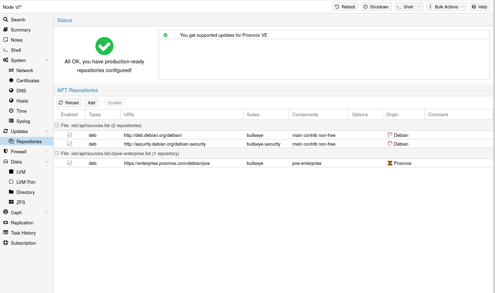

# 3. 호스트 시스템 관리 및 운영

Proxmox VE는 Debian GNU/Linux를 기반으로 하며, 추가 레포지토리를 통해 Proxmox VE 관련 패키지를 제공합니다. 즉, 보안 업데이트 및 버그 수정을 포함한 모든 범위의 Debian 패키지를 사용할 수 있습니다. Proxmox VE는 우분투 커널을 기반으로 하는 자체 Linux 커널을 제공합니다. 필요한 모든 가상화 및 컨테이너 기능이 활성화되어 있으며 ZFS 및 몇 가지 추가 하드웨어 드라이버가 포함되어 있습니다.<br><br>

<h2>3.1. 패키지 레포지토리</h2>

Proxmox VE는 다른 Debian 기반 시스템과 마찬가지로 <point>APT</point>를 패키지 관리 도구로 사용합니다.<br>
Proxmox VE는 매일 패키지 업데이트를 자동으로 확인합니다. <point>root@pam</point> 사용자는 사용 가능한 업데이트에 대해 이메일을 통해 알림을 받습니다. GUI에서 <point>changelog</point>버튼을 사용하여 선택한 업데이트에 대한 자세한 내용을 볼 수 있습니다.<br>

<h3>3.1.1. Proxmox VE의 레포지토리 </h3>
레포지토리는 소프트웨어 패키지의 모음으로, 새 소프트웨어를 설치하는 데 사용할 수 있을 뿐만 아니라 새 업데이트를 받는 데도 중요합니다.

>  <b>NOTE</b><br>
> 최신 보안 업데이트, 버그 수정 및 새로운 기능을 받으려면 유효한 Debian 및 Proxmox 레포지토리가 필요합니다.
<br>

APT 레포지토리는 `/etc/apt/sources.list` 파일과 `/etc/apt/sources.list.d/`에 있는 <point>.list</point> 확장자 파일에 정의되어 있습니다.

<br>

<point>레포지토리 관리</point><br>
<br>

Proxmox VE 7부터는 웹 인터페이스에서 레포지토리 상태를 확인할 수 있습니다. 노드 요약 패널에는 개략적인 상태 개요가 표시되며, 별도의 <point>Repository</point> 패널에는 구성된 모든 레포지토리의 심층적인 상태와 목록이 표시됩니다.

레포지토리 활성화 또는 비활성화와 같은 기본적인 레포지토리 관리도 지원됩니다.<br>


<point> sources.list 파일</point><br>

<point>sources.list</point> 파일에서 각 줄은 패키지 레포지토리를 정의합니다. 

선호하는 소스가 가장 먼저 나와야 하며, 빈 줄은 무시됩니다. <point>#</point> 문자는 해당 줄의 나머지 부분을 주석으로 표시합니다. 레포지토리에서 사용 가능한 패키지는 <point>apt-get update</point> 명령을 실행하여 얻습니다. 업데이트는 <point>apt-get</point>을 사용하여 직접 설치하거나, GUI(Node → Updates)를 통해 설치할 수 있습니다.<br>

<point> /etc/apt/sources.list 파일</point><br>

```
deb http://deb.debian.org/debian bookworm main contrib
deb http://deb.debian.org/debian bookworm-updates main contrib

# security updates
deb 
http://security.debian.org/debian-security bookworm-security main contrib

```
Proxmox VE는 세 가지 패키지 레포지토리를 제공합니다.<br><br>
